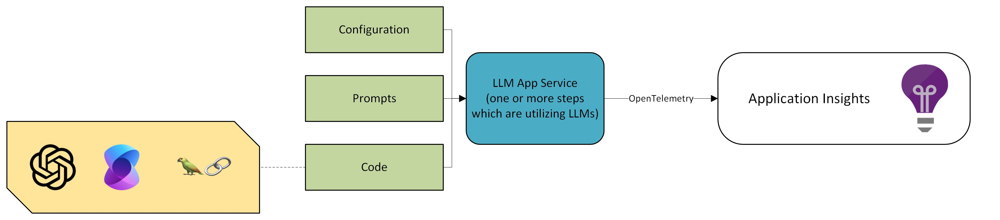
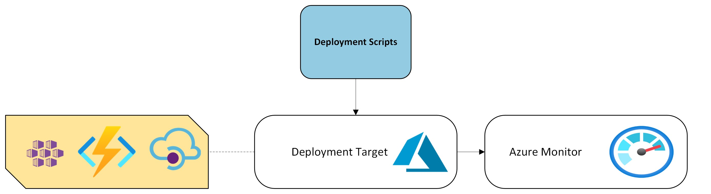
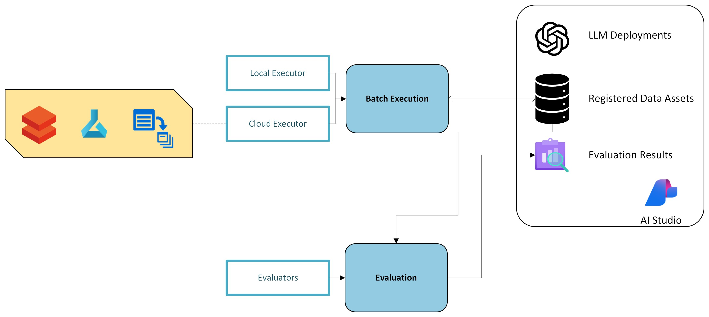
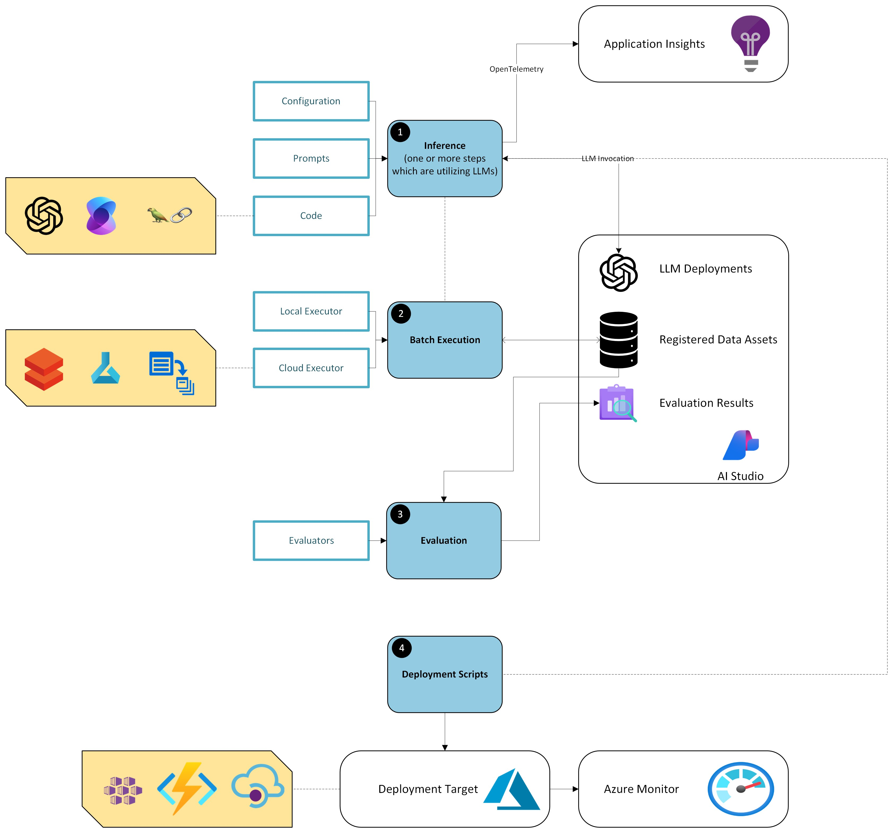

# MLOps for LLM Application Services

## Overall Architecture

### LLM Application Service components

Generative AI Solutions might include various components, including data management systems and workflows, APIs that provide access to knowledge databases, and search systems with multiple search capabilities.  At the same time, any such solution includes an **LLM-based Application Service** that glues all the elements together and provides endpoints for client applications. A fundamental example of such a service is a flow that identify an intent based on a user’s query, work with a search index or indexes to extract data and summarizes and returns a response using one of the LLMs. More complex examples might include several agents and interactions with several LLMs in a single flow. In any case, we assume that one or several LLMs will be involved, which means that the service’s response is **non-deterministic** (likely to have a different result every time), meaning that Machine Learning best practices should be involved to guarantee the quality of the service.

From a software engineering perspective, an LLM Application Service is just a service that can be implemented as a set of code files/scripts in C#, Python, Java, or any other language using various libraries, including Semantic Kernel, LangChain, OpenAI SDK and so on. Compared to other services, LLM-based ones always have additional components, including **configuration and prompts**, which are critical for successfully using LLMs. Another important element for most customers is **the observability features** that support the ability to understand the performance of LLM-based components like latency and cost, meaning that telemetry is the core component of the service. Suppose we pick OpenTelemetry as a potential way to collect traces and Application Insights to preserve and present observability details. In that case, we can visualize LLM Application Service using the following schema:

In the simplest form, our service might include a single Python file and Prompty configuration with **LLM parameters and prompt**. Developing such a service is relatively straightforward, and LLM-based frameworks include many basic and more complex examples to demonstrate how to do that. For example, Semantic Kernel examples for Python can be found [here](https://github.com/microsoft/semantic-kernel/tree/main/python/samples/concepts).

### Deployment and Monitoring

At the same time, having a set of scripts and configurations to deliver LLM Application Service as the completed solution is not enough. We are still missing two crucial elements: **deployment and evaluation**.

Our service should be deployed as a **batch, real-time, or near-real-time endpoint** (to serve long-running requests) or a set of endpoints. Azure offers a variety of methods to achieve that, from a custom Fast API service under Azure Kubernetes Service (AKS) to Azure Functions and Online Endpoints in Azure ML. The deployment process can be implemented as a **set of scripts executed from a DevOps system**. The deployment target is often linked to a monitoring service like Azure Monitor to understand the performance of the target, such as CPU and memory usage, traffic issues, and so on. The following diagram demonstrates the outcome of this paragraph:

### Evaluation

Since our service is non-deterministic, we need to understand the quality of the service by applying evaluation techniques. To run the evaluation, we need to **prepare a dataset with ground-truth data and generate an output dataset from the service** to compare with the ground-truth data. From a software engineering perspective, this means that we need to develop a pipeline to generate that output dataset. However, from an infrastructure perspective, we need a place to **store our datasets and a compute to run scripts** on a dataset in parallel. There are many ways to implement it, starting from local execution and up to running the service in Databricks, Fabric or Azure ML. For example, AI Studio, as a primary tool to manage LLMs in Azure, can also be used to preserve datasets.

Once we have ground truth and output from the LLM Application Service, we can use the data in the evaluation pipeline utilizing pre-defined or custom evaluators. Azure AI Evaluation SDK can run evaluators locally or publish custom evaluators into AI Studio and run them remotely. Evaluation results can be published in AI Studio or uploaded to a desired system. The diagram below illustrates the evaluation component:

 
Now, if we stick all the components together, we will get the following high-level architecture:

 

### DevOps Components

We should have Development and Operations (DevOps, MLOps, or even LLMOps) that invoke all the described components in the correct order and support abilities to do experimentation and testing in an environment where several data scientists and software engineers are working together at the same service. It’s a very well-known area, and as a starting point, we can propose a DevOps flow that includes three elements: **PR, CI and CD Builds**, which are explained in detail below.

**PR Build**: Data Scientists and Software Engineers are tuning the service into their feature branches. After passing quality checks, PR Build integrates/merges the changes into the development or main branch.

- Linting and Unit Testing to guarantee code quality and provide testing results.
- The evaluation step is where the application service code should be executed to prepare the evaluation set, and evaluators should be applied. Evaluation results should be published in a shared storage for review. If the evaluation process is time-consuming, it’s possible to use a small toy dataset to speed up the process. Still, the entire dataset should be evaluated in the next Build.
- Final approval from some team members before the merge.

**CI Build**: This should be executed on every merge to generate deployment artifacts.

- Evaluation should be executed on the full dataset (if not done in PR Build).
- LLM Application Service should be deployed into the development environment to make it available for developers of other solution components (like UI).
- The LLM Application Service deployment should be validated to guarantee that we don’t have issues with the deployment scripts.
- Deployment artifacts should be created and signed/approved as potential artifacts that may be deployed into the production environment.

**CD Build**: Deployment and validation of the service into the production environment.

- Deployment and validation of the approved artifact into the QA environment.
- After the QA deployment is validated/approved, the artifact is ready for the production environment. The Blue/Green Deployment approach can be applied for the final validation and A/B Testing (separating traffic between old and new deployments).
- After the final validation/testing, the new deployment is converted into the primary one.

For example, the proposed set of Builds can be implemented as a set of GitHub actions.

## Implementation Details

TBD

## How to start working with the template

TBD

## Contributing

This project welcomes contributions and suggestions.  Most contributions require you to agree to a
Contributor License Agreement (CLA) declaring that you have the right to, and actually do, grant us
the rights to use your contribution. For details, visit https://cla.opensource.microsoft.com.

When you submit a pull request, a CLA bot will automatically determine whether you need to provide
a CLA and decorate the PR appropriately (e.g., status check, comment). Simply follow the instructions
provided by the bot. You will only need to do this once across all repos using our CLA.

This project has adopted the [Microsoft Open Source Code of Conduct](https://opensource.microsoft.com/codeofconduct/).
For more information see the [Code of Conduct FAQ](https://opensource.microsoft.com/codeofconduct/faq/) or
contact [opencode@microsoft.com](mailto:opencode@microsoft.com) with any additional questions or comments.

## Trademarks

This project may contain trademarks or logos for projects, products, or services. Authorized use of Microsoft 
trademarks or logos is subject to and must follow 
[Microsoft's Trademark & Brand Guidelines](https://www.microsoft.com/en-us/legal/intellectualproperty/trademarks/usage/general).
Use of Microsoft trademarks or logos in modified versions of this project must not cause confusion or imply Microsoft sponsorship.
Any use of third-party trademarks or logos are subject to those third-party's policies.
