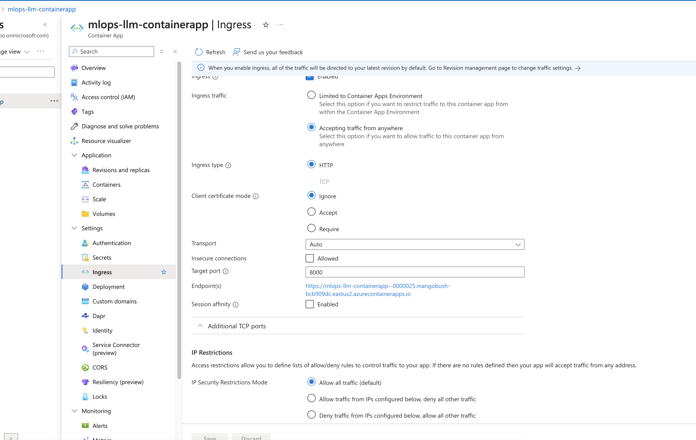

# Container app deployment

## Steps

Before running the CD for container app deployment of otel and financial analyst application, make sure the following are set as expected.

* Container App created in Azure portal with Ingress traffic allowing port 8080.

* User Assigned Managed Identity created and is assigned to container app.

* Managed Identity(User Assigned) with respective RBAC roles are set for the sk_financial_analyst application.

* Application Insights resource created.
