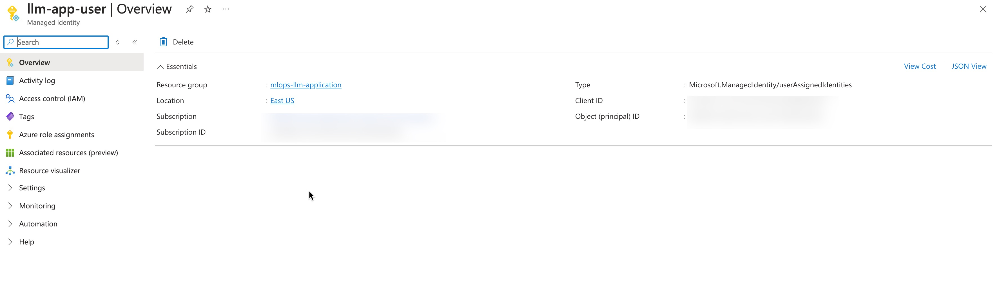
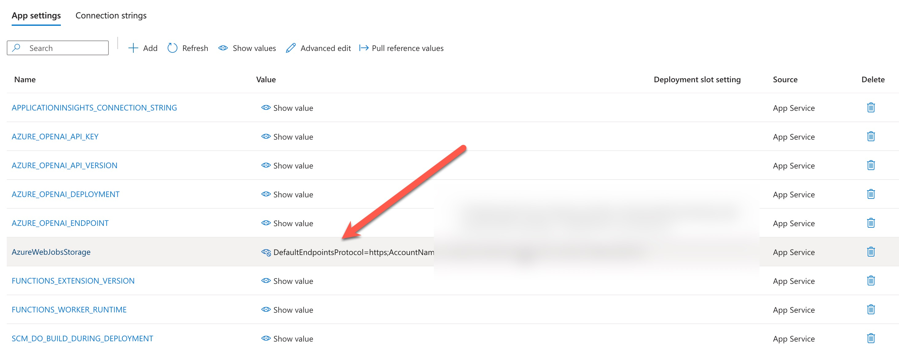
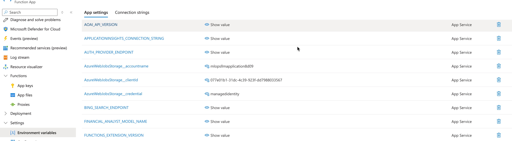
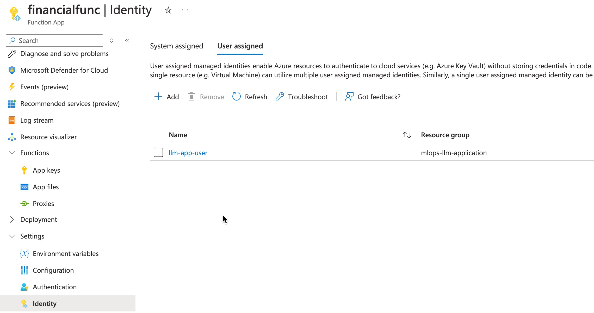

# Durable Azure Function as a Deployment Target

## Introduction

[Azure Functions](https://learn.microsoft.com/en-us/azure/azure-functions/) and [Azure Durable Functions](https://learn.microsoft.com/en-us/azure/azure-functions/durable/) provide access to a serverless solution for microservices implementation. They support various programming languages, including Python and C#, and both real-time and long-running services can be implemented using a unified Azure environment.

This repository includes an example (Financial Analysis) that may take a few minutes to execute per request. As such, Azure Functions is a suitable deployment option since it supports this type of workload.

The primary goal of this document is to demonstrate a way to setup an Azure Function with abilities to interact with Open AI, Azure Storage and other services using key less approach.

## User-Assigned Managed Identity

It's best practice to avoid key storage and sharing during the development process. If an engineer needs to test something on a local computer, Entra ID integration can be utilized, and the engineer's credentials should be used.
However, when deploying a service, it's not always possible to use the user's Entra credentials, especially if the service is a chain element of a complex system.

[User-Assigned Managed Identity](https://learn.microsoft.com/en-us/entra/identity/managed-identities-azure-resources/overview) can be a solution to the problem mentioned above. It allows us to create a system user with a set of permissions, which can be assigned to Azure services to provide a unique execution context where no keys are needed.
Potentially, System Managed Identity can be used instead, but it cannot be shared across resources if needed.


In order to setup an Azure Function to work under User-Assigned Managed Identity we need [to create it](https://learn.microsoft.com/en-us/entra/identity/managed-identities-azure-resources/how-manage-user-assigned-managed-identities?pivots=identity-mi-methods-azp).
It can be done through the portal, Azure CLI, Resource Manager and so on.
In any case, it's a straightforward process that requires picking a name, which should be noted along with the associated client ID that will be assigned right after creation.



## Roles

Once a User-Assigned Managed Identity has been created, it's possible to assign the needed roles to it. The set of roles might vary depending on your needs, but we will enumerate the roles required for the Financial Analyst Report application example in this repository.

- **Azure Storage roles**: All Azure Functions have associated Azure Storage account, and Durable Azure Functions [use Blobs, Tables and Queues from it](https://learn.microsoft.com/en-us/azure/azure-functions/durable/durable-functions-azure-storage-provider).
It means that User-Assigned Managed Identity should have access to all three entities to make sure that Azure Functions can operate.
**Storage Blob Data Contributor**, **Storage Table Data Contributor** and **Storage Queue Data Contributor** should be assigned.

- **Azure Key Vault**: The Financial Analyst application is using KeyVault to get access to some secure information like third-party service keys.
User-Assigned Managed Identity should have access to these records and **Key Vault Secrets Officer** can be assigned to the identity to achieve the goal.

- **Azure Open AI**: The Financial Analyst application uses Open AI ChatGPT models. Therefore, **Cognitive Services OpenAI User** should be assigned.


## Azure Functions Parameters

Once we have User-Assigned Managed Identity it's important to setup Azure Function to use it for internal needs (got access to the associated storage account).
Pay attention, that portal doesn't support User-Assigned Managed Identity in the deployment wizard for Azure Functions.
Therefore, App Settings page will contain some records that use connection strings and keys - these records should be deleted.



Additional records should be added to App Settings of Azure Functions:

- **AzureWebJobsStorage__accountname**: a storage account name of the associated storage account.
- **AzureWebJobsStorage__credential**: **managedidentity** value should be here.
- **AzureWebJobsStorage__clientId**: client id of the created User-Assigned Managed Identity should be in this field.



Once all the values are provided Azure Functions will be able to communicate with the associated storage account with no explicit connection strings.

## Obtaining Credentials in Code

Finally, we need to make sure that Azure Functions can use our identity in code to communicate with other services.

First, we need to explicitly allow to use our identity from code. It can be done using **Identity** tab in the **Settings** of the Function App.



Second, our code should specify which identity to use since several different identities can be assigned to the service.
It can be done like this:

```Python
credential = DefaultAzureCredential(managed_identity_client_id=managed_identity_client_id)
```

As you can see `DefaultAzureCredential` class should take **managed_identity_client_id**, and you can read this parameter from **AzureWebJobsStorage__clientId** if you share the same identity.

## Testing and Deployment

Testing can be done on a local computer in the usual way, but DefaultAzureCredentials should ignore AzureWebJobsStorage__clientId in this case and be used with no parameters.

Example of the deployment command for our example is:

```bash
az functionapp deployment source config-zip -g mlops-llm-application -n financialfunc --src build.zip --build-remote true
```
