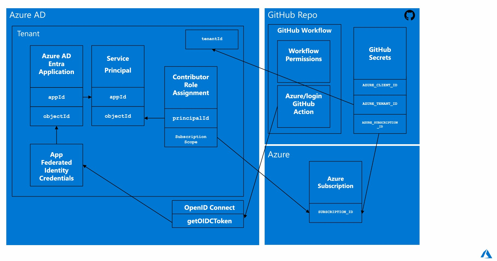
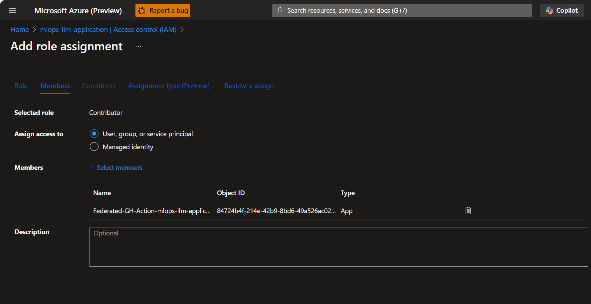
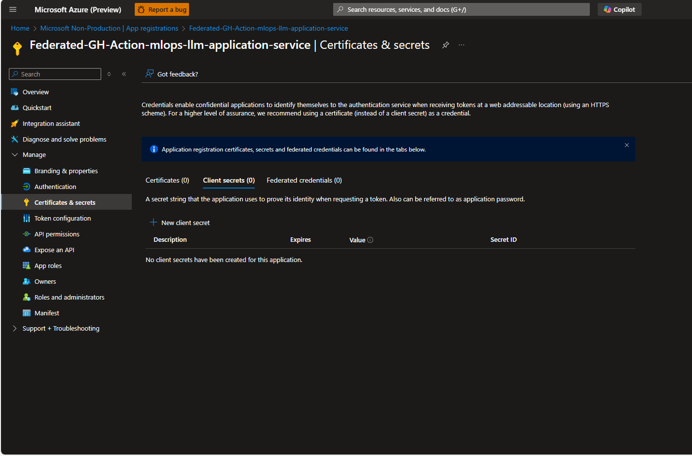
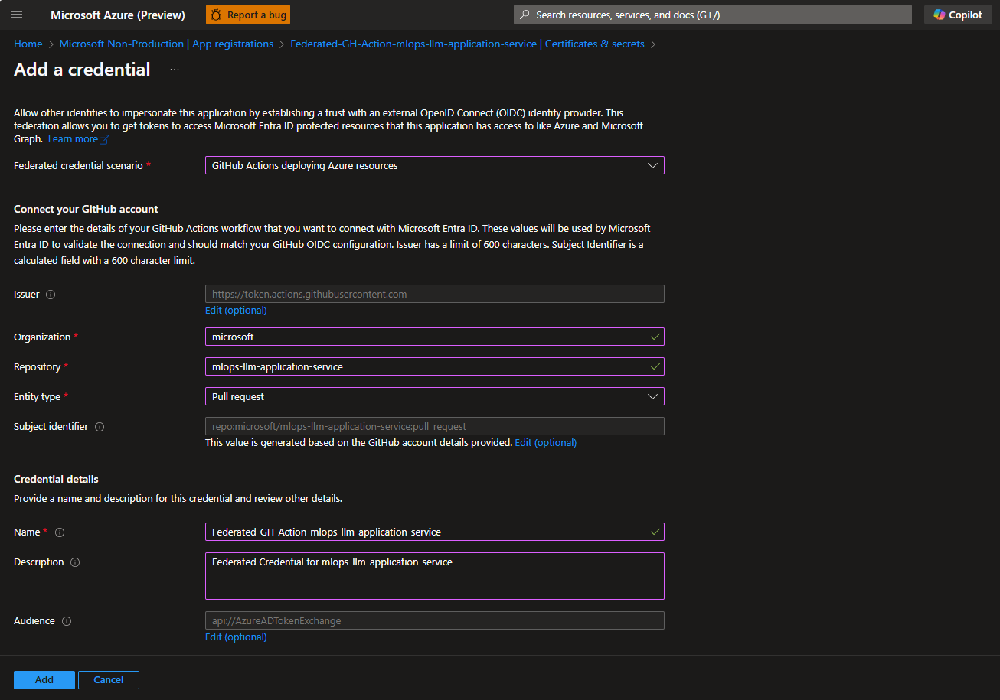
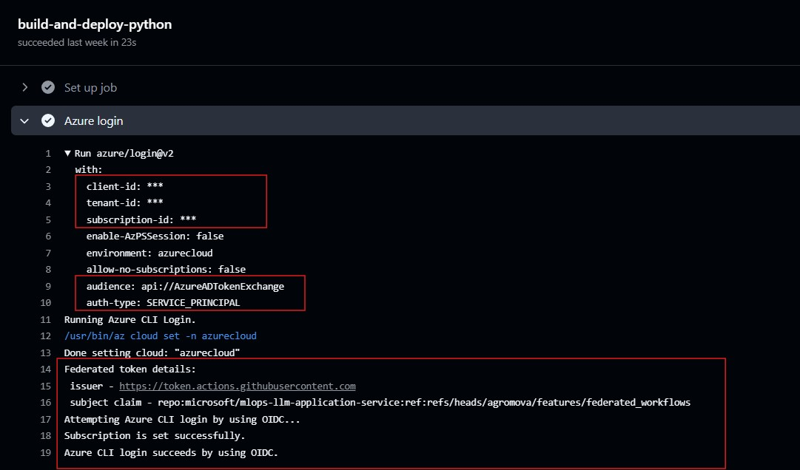

## How to connect to Azure from GitHub Actions Workflows with OpenID Connect (OIDC) Federated Credentials
In the past, we used a Service Principal password as the GitHub secret `AZURE_CREDENTIALS` along with the `azure/login` action to authenticate with Azure resources. The major limitation of this approach was that the Service Principal password was stored directly as a secret, which could change or expire, requiring manual updates with a new value.

The OpenID Connect (OIDC) Federated Credentials approach allows GitHub Actions workflows to securely authenticate with Azure services without needing to store long-lived secrets or credentials. While OIDC still requires the Azure AD and Service Principles, there is no longer a need to store the Service Principals password directly in the GitHub secret. Instead storing the AZURE_CLIENT_ID, AZURE_TENANT_ID, and AZURE_SUBSCRIPTION_ID of the Microsoft Entra application. Once the GitHub workflow runs, it requests a token from Azure AD using Federated Identity Credentials.

This is achieved by leveraging the OIDC protocol to establish trust between GitHub and Azure. GitHub's OIDC provider works with Azure's workload identity federation. Below are the links to the official documentation.
* [Microsoft:Workload-identity-federation](https://learn.microsoft.com/en-us/entra/workload-id/workload-identity-federation)
* [Use GitHub Actions to connect to Azure](https://learn.microsoft.com/en-us/azure/developer/github/connect-from-azure-openid-connect)
* [Authenticate to Azure from GitHub](https://learn.microsoft.com/en-us/azure/developer/github/connect-from-azure-openid-connect)

OpenID Connect (OIDC) with Azure and GitHub



* ### Step 1: Register a Microsoft Entra Application & Assign Contributor Role to the application
    1. Create a Microsoft Entra application with a service principal by [Azure portal] (https://learn.microsoft.com/en-us/entra/identity-platform/howto-create-service-principal-portal#register-an-application-with-microsoft-entra-id-and-create-a-service-principal). 
    Copy values:  Client ID, Subscription ID, and Directory (tenant) ID. 

    2. Add a Role Assignment `Contributor` (select "Add User, group or service principal"), and search for your Application.
    Assign a role to the application. 
    


* ### Step 2: Federated Credentials
    1. Once the managed identity is provisioned, go to App registrations and select `Certificates & secrets` under Manage section.
    

    2. Add federated credential to trust tokens issued by GItHub Actions. 
    In this section, you will need to add a federated credential. 
    The `Entity Type` is used to define the scope of the OIDC requests from GitHub Workflows. Valid options are `Environment`, `Branch`, `Pull request`, `Tag`.
    * To set up Federated Credential, click "Add Credential": 
        Set Scenario to ``Github Actions deploying Azure resources``

        Begin by filling in necessary fields (Organization, Repository, set Entity Type: `Pull request`)
        


* ### Step 3: Set GitHub Permissions and Secrets/Variables
    1. Set GitHub workflows permissions so that the token can work with Azure subscription. The workflow requires `id-token: write` and `contents: read` permissions. The `id-token: write` permission allows the workflow to request an OIDC token from GitHub's OIDC provider.
    2. Create GitHub secrets/variables to store Microsoft Entra application details or user-assigned managed identity for your GitHub secrets:
      * AZURE_CLIENT_ID
      * AZURE_TENANT_ID
      * AZURE_SUBSCRIPTION_ID
    3. Configure `azure/login@`action within GitHub workflows to exchange GitHub tokens issued to the workflow for an access token from Microsoft identity platform. The `azure/login@`action picks up the OIDC token and exchanges it with Azure Active Directory (Azure AD) to obtain an access token. Azure AD verifies the OIDC token and issues an access token if the token is valid and the federated identity credential configuration matches.


* ### Step 4: CI Workflow example with OpenID Connect and the Azure login action.
     The `platform_ci_python.yaml` pipeline workflow contains a single job, `build-and-deploy-python`, which Github Actions to generate OIDC token. The `azure/loging@v2` will pick up and exchange against AAD. Start by adding permissions and `azure/login@v2` action:

  * ``platform_ci_python.yaml``
      ```
      name: CI Platform Python Workflow

      on:
        push:
          branches:
            - 'main'

      permissions:
        id-token: write
        contents: read

      jobs:
        build-and-deploy-python:
          runs-on: ubuntu-latest
          steps:
            - name: Azure login
              uses: azure/login@v2
              with:
                client-id: ${{ secrets.AZURE_CLIENT_ID }}
                tenant-id: ${{ secrets.AZURE_TENANT_ID }}
                subscription-id: ${{ secrets.AZURE_SUBSCRIPTION_ID }}

      ```
  * 
  