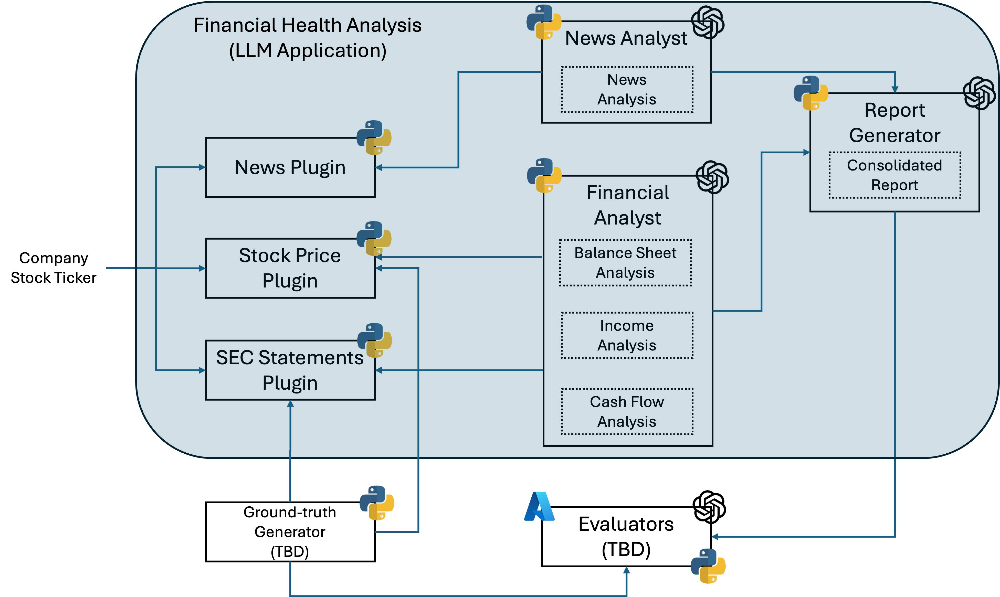
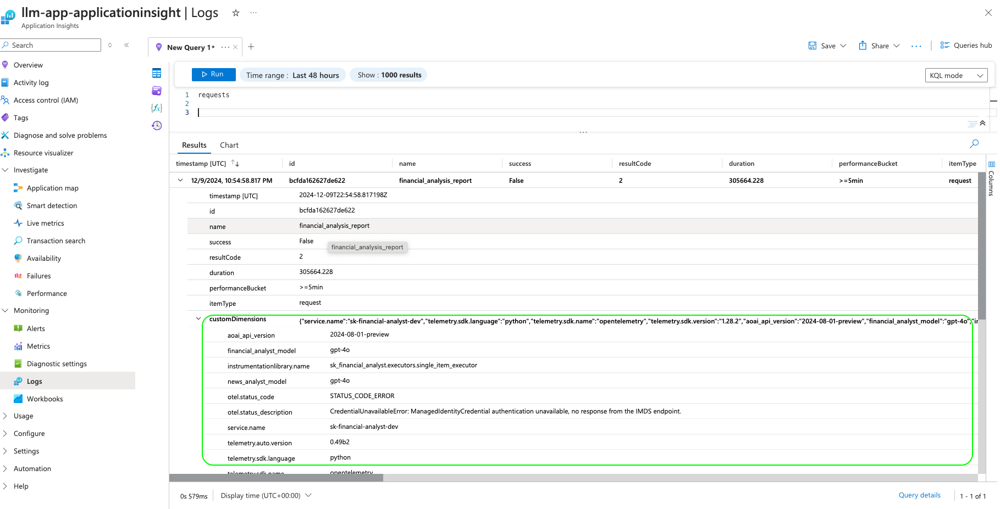
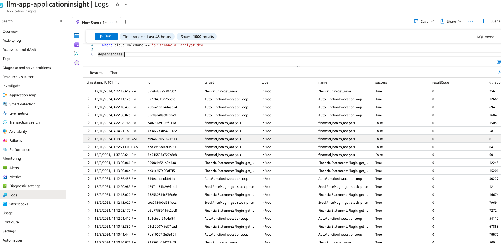

## SK Financial Analyst

SK Financial Analyst is a Python-based financial health analysis tool that leverages Semantic Kernel, external APIs, and Large Language Models (LLMs) to analyze financial statements, news articles, and stock prices to generate a consolidated financial health report of public companies.

### Features

- **News Analysis**: Analyze sentiment in financial news articles related to a company's stock ticker.
- **Financial Statement Analysis**: Analyze balance sheet, income statement, and cash flow reports.
- **Consolidated Report**: Generate a structured consolidated report, following a pre-defined JSON schema, combining financial statement and news analyses.

### Modules

- `assistants/assistants.py`: Defines assistants such as NewsAnalyst, FinancialAnalyst, and StructuredReportGenerator that perform specific analysis tasks.
- `assistants/data_models.py`: Defines Pydantic data models used for structured data representation.
- `plugins/plugins.py`: Implements plugins for fetching data from external APIs, such as Bing News Search, Yahoo Finance, and SEC Edgar filings.
- `utils/report_generator.py`: Converts JSON reports to markdown format.

### Architecture

Here is a diagram showing a high-level architecture:



### Installation

1. Clone the repository:
   ```bash
   git clone https://github.com/microsoft/mlops-llm-application-service.git
   cd python

2. Set up a virtual environment (optional but recommended):
   ```bash
   python3 -m venv venv
   source venv/bin/activate

3. Install the required dependencies:
   ```bash
   pip install --upgrade -r requirements.txt

### Configuration

#### Azure OpenAI

You need to have access to an Azure OpenAI service and have at least one model deployed. Follow [this instructions](https://learn.microsoft.com/en-us/azure/ai-services/openai/how-to/create-resource) if you need to create one.

#### Bing Search

You need to have access to a Bing Search service API. Follow [this instructions](https://learn.microsoft.com/en-us/bing/search-apis/bing-web-search/create-bing-search-service-resource) if you need to create one.

#### Azure Key Vault

You need to have access to an Azure Key Vault where you can write and read secrets. Follow [this instructions](https://learn.microsoft.com/en-us/azure/key-vault/general/quick-create-portal) if you need to create one.

You need to create four secrets:
- `AOAI-BASE-ENDPOINT`: this is the base endpoint of your Azure OpenAI deployment.
- `BING-SEARCH-API-KEY`: this is the API key for the Bing Search service.
- `SEC-IDENTITY`: this is an identity in the form of `<your name> <your email address>` that is needed for the application to make requests to the SEC Edgar database to get financial statements.
- `APP-INSIGHTS-CONNECTION-STRING`: this is the connection string of your Azure Application Insights deployment.

Follow [this documentation](https://learn.microsoft.com/en-us/azure/key-vault/general/security-features#controlling-access-to-key-vault-data) to learn how to configure access for reading / writing secrets in Azure Key Vault.

#### .env

Before running the code, create the `pyton/.env` file, using the provided `python/.env_sample` as example, and enter the needed values for your resource endpoints and deployment names.

You need to enter the Azure OpenAI model deployment names, in your Azure OpenAI service, you want to use for each assistant, as well as your Azure Key Vault endpoint. We recommend to use the `gpt-4o` model, for better and more accurate reports.

The Report Generator assistant uses the structured outputs functionality from OpenAI. As of this writing, only `gpt-4o` with API version at least `2024-08-01-preview` is supported. [Look here](https://learn.microsoft.com/en-us/azure/ai-services/openai/how-to/structured-outputs) for the list of models and API versions supporting structured outputs.

There is also specific requirements related to structured outputs in Semantic Kernel. As of this writing, only the API version `2024-08-01-preview` is supported. [Look here](https://github.com/microsoft/semantic-kernel/blob/main/python/samples/concepts/structured_output/README.md) for the list of models and API versions supporting structured outputs in Semantic Kernel.

### Running the Code

The code uses an Azure Managed Identity Credential to get tokens to access the Azure OpenAI service and Azure Key Vault. It was tested running from `VSCode` authenticating to Azure.

When running the main Python script, you generate two consolidated financial health analysis for a public company: one as a structured JSON output, following a pre-defined schema, and a markdown version generated from it. To run the code, go to the `python` folder, and execute:

```bash
python -m sk_financial_analyst.executors.single_item_executor --stock_ticker <STOCK_TICKER>
```

`<STOCK_TICKER>` is set by default to `MSFT`. You can run:

```bash
python -m sk_financial_analyst.executors.single_item_executor --help
```

to see all available command line options.

`sk_financial_analyst/data/outputs` is already populated with some example reports.

You can also generate reports in a batch, for a list of companies. There is already a pre-defined list under `python/sk_financial_analyst/data/inputs/tickers.jsonl`. To run a batch of reports using that list, go to the `python` folder and execute:

```bash
python -m sk_financial_analyst.executors.batch_executor
```

You can run:

```bash
python -m sk_financial_analyst.executors.batch_executor --help
```

to see all available command line options.

To get results using fast api rest endpoint:

```bash
cd python
uvicorn sk_financial_analyst.routes.routes:app --port 5000
# once the app is up, the /get endpoint can be accessed using
curl -v http://localhost:5000/api/generate_financial_report/MSFT
```

### Deployment

```bash
cd python
docker compose -f common/deployments/docker-compose.yaml up --build --remove-orphans --detach
# to check the status of container(should be up and running)
docker ps
# to monitor logs
docker logs <container_id>
# to access the endpoint
curl -v http://localhost:8000/api/generate_financial_report/MSFT
```

Detailed steps for deployment to an environment are [here][../../docs/containerApp_deployment_steps.md]

### Observability

The spans and attributes set for the span for the application are captured in the requests table of application insights as highlighted
below.



The logs are traced in the dependencies table of application insights.


